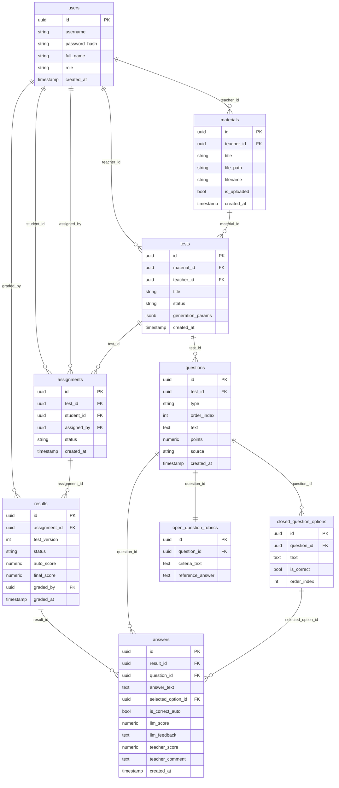

```mermaid
erDiagram
    users ||--o{ materials : "teacher_id"
    users ||--o{ tests : "teacher_id"
    users ||--o{ assignments : "student_id"
    users ||--o{ assignments : "assigned_by"
    users ||--o{ results : "graded_by"

    materials ||--o{ tests : "material_id"

    tests ||--o{ questions : "test_id"
    questions ||--o{ closed_question_options : "question_id"
    questions ||--|| open_question_rubrics : "question_id"

    tests ||--o{ assignments : "test_id"
    assignments ||--o{ results : "assignment_id"

    results ||--o{ answers : "result_id"
    questions ||--o{ answers : "question_id"
    closed_question_options ||--o{ answers : "selected_option_id"

    users {
        uuid id PK
        string username
        string password_hash
        string full_name
        string role
        timestamp created_at
    }

    materials {
        uuid id PK
        uuid teacher_id FK
        string title
        string file_path
        string filename
        bool is_uploaded
        timestamp created_at
    }

    tests {
        uuid id PK
        uuid material_id FK
        uuid teacher_id FK
        string title
        string status
        jsonb generation_params
        timestamp created_at
    }

    questions {
        uuid id PK
        uuid test_id FK
        string type
        int order_index
        text text
        numeric points
        string source
        timestamp created_at
    }

    closed_question_options {
        uuid id PK
        uuid question_id FK
        text text
        bool is_correct
        int order_index
    }

    open_question_rubrics {
        uuid id PK
        uuid question_id FK
        text criteria_text
        text reference_answer
    }

    assignments {
        uuid id PK
        uuid test_id FK
        uuid student_id FK
        uuid assigned_by FK
        string status
        timestamp created_at
    }

    results {
        uuid id PK
        uuid assignment_id FK
        int test_version
        string status
        numeric auto_score
        numeric final_score
        uuid graded_by FK
        timestamp graded_at
    }

    answers {
        uuid id PK
        uuid result_id FK
        uuid question_id FK
        text answer_text
        uuid selected_option_id FK
        bool is_correct_auto
        numeric llm_score
        text llm_feedback
        numeric teacher_score
        text teacher_comment
        timestamp created_at
    }
```